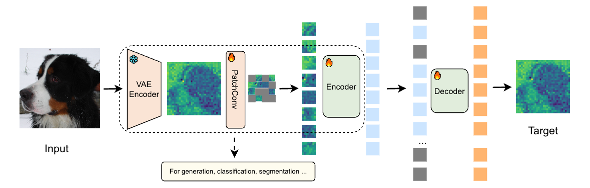
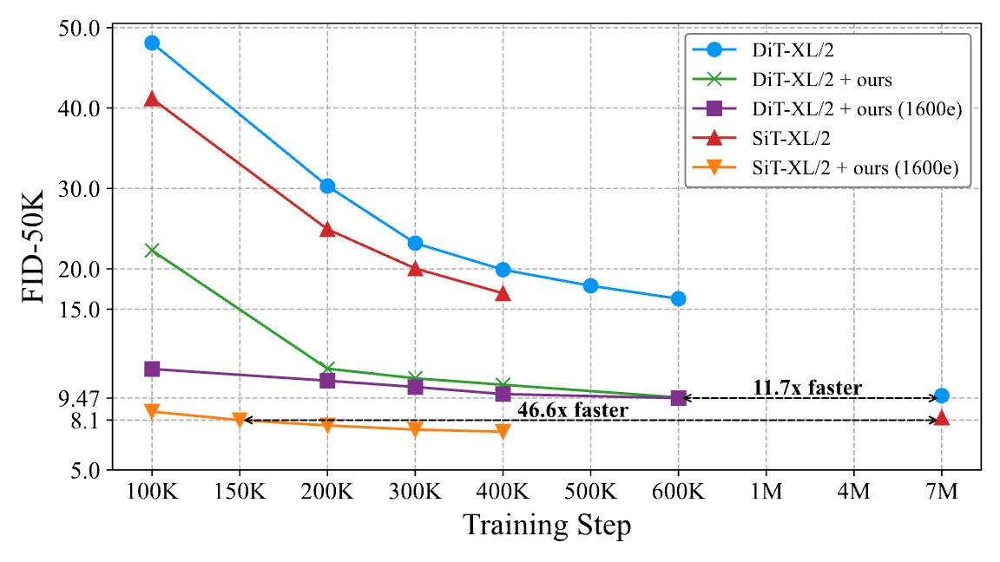

<h1 align="center">
USP: Unified Self-Supervised Pretraining for Image Generation and Understanding
</h1>

[](https://arxiv.org/abs/2503.06132)

This is official implementation of USP.



Converge much faster just with weight initialization from pretrain. 



If you find USP useful in your research or applications, please consider giving a star ⭐ and citing using the following BibTeX:
```
@misc{chu2025uspunifiedselfsupervisedpretraining,
      title={USP: Unified Self-Supervised Pretraining for Image Generation and Understanding}, 
      author={Xiangxiang Chu and Renda Li and Yong Wang},
      year={2025},
      eprint={2503.06132},
      archivePrefix={arXiv},
      primaryClass={cs.CV},
      url={https://arxiv.org/abs/2503.06132}, 
}

```
### Catalog

- [x] Pre-training code
- [x] (ImageNet SFT and linear probe finetuning code)


## Introduction
Recent studies have highlighted the interplay between diffusion models and representation learning. Intermediate representations from diffusion models can be leveraged for downstream visual tasks, while self-supervised vision models can enhance the convergence and generation quality of diffusion models. However, transferring pretrained weights from vision models to diffusion models is challenging due to input mismatches and the use of latent spaces. To address these challenges, we propose Unified Self-supervised Pretraining (USP), a framework that initializes diffusion models via masked latent modeling in a Variational Autoencoder (VAE) latent space. USP achieves comparable performance in understanding tasks while significantly improving the convergence speed and generation quality of diffusion models.

[//]: # (## Updates)

[//]: # ()
[//]: # (Our code is released.)
## Pretraining
Please refer to  [PRETRAIN.md](./pretrain/PRETRAIN.md)
## Downstream Task
### Generation

[//]: # (### Image Generation Under the DiT Framework)

[//]: # (### Image Generation Under the SiT Framework)

[//]: # (### Image Understanding)

## Acknowledgement

Our  code are based on  [MAE](https://github.com/facebookresearch/mae), [DiT](https://github.com/facebookresearch/DiT), [SiT](https://github.com/willisma/SiT) and  [VisionLLaMA](https://github.com/Meituan-AutoML/VisionLLaMA). Thanks for their great work.


